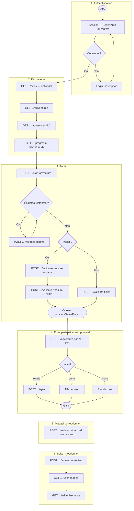

# Flux API, authentification et logique de jeu

Ce document décrit **l’ordre d’appel des routes**, la **logique métier** du parcours joueur, l’**authentification**, la **gestion des lots** (roue partenaires fin d’aventure), et les **séparations** avec les publicités / offres partenaires classiques.

Références complémentaires :

- [`README.md`](../README.md) — vue d’ensemble, tableaux d’API, checklist mobile.
- [`docs/expo-better-auth.md`](expo-better-auth.md) — session (web / Expo) pour les routes jeu.
- OpenAPI : `src/lib/openapi/grand-est-openapi-document.ts`, `GET /api/openapi`.
- Accès public / démo : `src/lib/adventure-public-access.ts`.
- Finalisation partie : `src/lib/badges/award-on-finish.ts` (`processGameFinish`), `src/lib/game/server-adventure-progress.ts`.
- Roue partenaires : `src/lib/adventure-partner-lots/adventure-partner-lots.ts`, `src/lib/adventure-partner-lots/adventure-partner-lots-logic.ts`.

---

## 1. Authentification (Better Auth)

| Élément | Rôle |
|--------|------|
| **`/api/auth/[...all]`** (`src/app/api/auth/[...all]/route.ts`) | Point d’entrée Better Auth : inscription, session, OAuth, reset mot de passe, etc. |
| **Session** | Les routes **jeu** et **utilisateur** attendent une session valide (cookies navigateur ; équivalent documenté pour Expo). |
| **`GET /api/admin-game/permission-context`** | Contexte rôle / permissions pour le **dashboard web** admin — utile au front admin, pas au cœur du parcours terrain. |

**Principe** : sans session, les routes concernées répondent **`401`**. Certaines routes **catalogue** (`GET /api/game/cities`, `GET /api/game/adventures`, …) restent accessibles sans compte selon les règles produit (voir OpenAPI et `adventure-public-access`).

---

## 2. Routes API par domaine

### 2.1 Jeu — catalogue et contenu statique

| Méthode | Route | Quand l’appeler |
|--------|--------|------------------|
| `GET` | `/api/game/cities` | Liste des villes (référentiel). |
| `GET` | `/api/game/adventures` | Catalogue **PUBLIC** + actives (les aventures **DEMO** n’y figurent pas). |
| `GET` | `/api/game/adventures/{id}` | Détail : énigmes, trésor, `discoveryPoints` de la ville, durées, etc. **DEMO** : session + droit requis. |
| `GET` | `/api/game/discovery-points?cityId=` | POI « découverte » pour une carte **ville** (usage hors fiche aventure si besoin). |
| `GET` | `/api/game/avatars` | Avatars compagnon actifs (`id`, `slug`, `name`, …) — **sans session** ; les fichiers **3D** sont dans **l’app** (mapping par `slug`). |

### 2.2 Jeu — parcours (session joueur)

| Méthode | Route | Quand l’appeler |
|--------|--------|------------------|
| `GET` | `/api/game/progress?adventureId=` | Synchroniser l’état : étapes validées côté serveur, fin éventuelle, etc. |
| `POST` | `/api/game/start-adventure` | Au **« Commencer »** (recommandé) : ouvre une **`UserAdventurePlaySession`** `IN_PROGRESS` (idempotent). |
| `POST` | `/api/game/validate-enigma` | Après chaque bonne réponse, **dans l’ordre** des énigmes imposé par le serveur. |
| `POST` | `/api/game/validate-finish` | **Sans trésor** : lorsque **toutes** les énigmes sont validées **et** qu’il n’existe **pas** de trésor sur l’aventure. |
| `POST` | `/api/game/validate-treasure` | **Avec trésor** : **carte** (`treasure:map`) puis **coffre** (`treasure`) — même route, codes successifs. |

**Règle importante** : si un **trésor** est configuré, la finalisation badges / `UserAdventures` passe par l’étape **coffre** de `validate-treasure`. `validate-finish` renvoie alors une erreur du type **`TREASURE_REQUIRED`**. Sans trésor, c’est **`validate-finish`** qui appelle la même finalisation que le code coffre (`processGameFinish`).

### 2.3 Jeu — après victoire (optionnel)

| Méthode | Route | Quand l’appeler |
|--------|--------|------------------|
| `GET` | `/api/game/adventure-partner-lots?adventureId=` | Après **succès** : état roue (`legalNotice`, `wheel`, `segments`, `won` avec `validUntil`, `redeemed`, …). |
| `POST` | `/api/game/adventure-partner-lots/spin` | Si `wheel === "ready"` : tirage **serveur** (une fois par couple utilisateur × aventure). |
| `POST` | `/api/game/adventure-partner-lots/redeem` | En magasin : confirmation **usage unique** du gain ; **200** idempotent si déjà validé (`alreadyRedeemed`). |
| `POST` | `/api/game/adventure-review` | Avis / signalements fin de parcours. |
| `GET` | `/api/game/adventure-reviews` | Liste publique d’avis modérés. |
| `GET` | `/api/game/adventure-reviews/{id}` | Détail d’un avis public. |

### 2.4 Jeu — découverte (hors fil d’énigmes)

| Méthode | Route | Quand l’appeler |
|--------|--------|------------------|
| `POST` | `/api/game/claim-discovery` | Sur place (GPS) pour réclamer un badge **point de découverte**. |

### 2.5 Utilisateur connecté

| Méthode | Route | Rôle |
|--------|--------|------|
| `GET` | `/api/user/badges` | Badges du joueur. |
| `GET` | `/api/user/avatar` | Préférence avatar (`selectedAvatarId`, objet `selectedAvatar` si défini). |
| `PATCH` | `/api/user/avatar` | Corps `{ "selectedAvatarId": "<id Prisma>" }` ou `null` pour effacer ; avatar doit être **actif** (`GET /api/game/avatars`). |
| `POST` | `/api/user/advertisement-dismissals` | Masquer une pub pour ce compte (persistant). |

### 2.6 Publicités et offres partenaires « encart » (distinct de la roue aventure)

| Méthode | Route | Rôle |
|--------|--------|------|
| `GET` | `/api/advertisements` | Encarts (placement, géo, dates…). |
| `POST` | `/api/advertisements/events` | Impression / clic. |
| `POST` | `/api/partner-offers/claims` | Demande joueur liée à une **`Advertisement`**. |
| `GET` | `/api/partner-offers/claims` | Historique joueur. |
| `GET` | `/api/merchant/partner-claims` | File commerçant (`role` + rattachement pub). |
| `POST` | `/api/merchant/partner-claims/{id}/resolve` | Approuver / refuser. |

### 2.7 Cron (infrastructure)

| Méthode | Route | Auth | Rôle |
|--------|--------|------|------|
| `GET` | `/api/cron/expire-partner-claims` | `Authorization: Bearer $CRON_SECRET` | Expire les **`PartnerOfferClaim`** `PENDING` trop anciennes. |
| `GET` | `/api/cron/recompute-adventure-durations` | idem | Sessions **`ABANDONED`**, recalcul **moyennes de durée** par aventure. |

### 2.8 Fichiers et documentation machine

| Méthode | Route | Rôle |
|--------|--------|------|
| `GET` | `/api/uploads/...` | Fichiers sous `uploads/`. |
| `GET` | `/api/openapi` | JSON OpenAPI (si activé). |

---

## 3. Schéma de flux — du lancement à la fin de partie

---

## 4. Modèles de données utiles (résumé)

| Concept | Rôle |
|--------|------|
| **`UserAdventurePlaySession`** | Durée de partie : `IN_PROGRESS` → clôture succès / échec ; abandon au cron si trop ancien. |
| **`UserAdventureStepValidation`** | Étapes validées serveur (`enigma:n`, `treasure:map`, `treasure`). |
| **`UserAdventures`** | Succès / échec ; condition pour la roue et le `redeem`. |
| **`AdventurePartnerLot`** | Segment de roue : périmètre **aventure** ou **ville**, poids, stock, dates, actif. |
| **`UserAdventurePartnerLotWin`** | Un tirage par (utilisateur, aventure) ; **`redeemedAt`** pour usage magasin. |
| **`Adventure.partnerWheelTerms` / `City.partnerWheelTerms`** | Texte **règlement** ; exposé en **`legalNotice`** (priorité aventure, puis ville). |

---

## 5. Administration web (`/admin-game`)

- Interface **Next.js** + **server actions** (pas une duplication de toutes les routes ci-dessus).
- Gestion des **lots**, **stats / export CSV**, **textes de règlement** sur la fiche aventure ; **règlement ville** sur la fiche ville.
- **Rôles** : voir [`README.md`](../README.md) — le compte **merchant** ne gère pas les aventures mais les **réclamations** liées aux **publicités**.

---

## 6. Rate limiting

Plusieurs routes utilisent `src/lib/api/simple-rate-limit.ts` (mémoire **par instance**). Voir OpenAPI pour les ordres de grandeur par route.

---

## 7. Checklist intégrateur mobile (rappel)

1. Session stable ([`expo-better-auth.md`](expo-better-auth.md)).
2. Lire `treasure` dans `adventures/{id}` pour choisir **finish** vs **treasure**.
3. `validate-enigma` : ordre + `multiSelect` / `submissions`.
4. Après victoire : `adventure-partner-lots` → `spin` → affichage `validUntil` / `legalNotice` → `redeem` en boutique.
5. Ne pas confondre **roue aventure** et **`partner-offers/claims`** (flux **Advertisement**).

---

Pour un **plan de mise en œuvre** avec cases à cocher côté Expo : [`integration-app-mobile-checklist.md`](integration-app-mobile-checklist.md).

---

*Document de synthèse ; les corps JSON exacts et codes d’erreur sont dans l’OpenAPI.*
